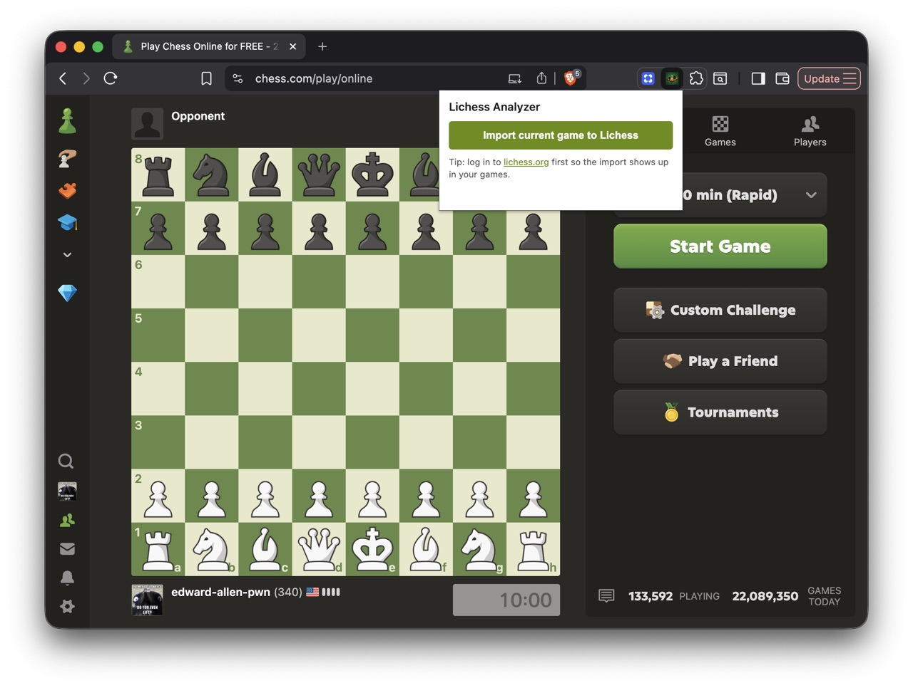
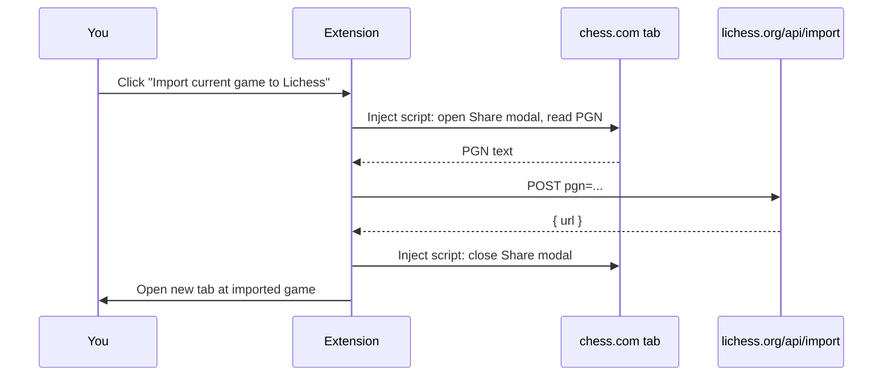

# Lichess Analyzer

Chrome extension that imports the chess.com game you're currently viewing into [lichess.org](https://lichess.org) with a single click — so you can use Lichess's analysis board on chess.com games.



## How it works



1. Open any finished chess.com game page (live or daily).
2. Click the extension icon → **Import current game to Lichess**.
3. The extension automates the chess.com share modal to grab the PGN, then POSTs it to `https://lichess.org/api/import`.
4. A new tab opens on lichess with your imported game, ready for the analysis board.

## Login

The extension does not log you in anywhere. For the best experience, **log in to lichess.org in your browser first** — imports made while logged in are attached to your account and appear in your games list. Imports made while logged out still work, but are anonymous and only accessible via the URL you get back.

## Install

### From a release zip (no build step)

1. Download the latest `lichess-analyzer-vX.Y.Z.zip` from the [Releases page](../../releases).
2. Unzip it.
3. Visit `chrome://extensions`, enable **Developer mode**, click **Load unpacked**, and pick the unzipped folder.

### From source

1. Clone this repo.
2. Visit `chrome://extensions`, enable **Developer mode**, click **Load unpacked**, and pick this folder.

## Permissions

- `activeTab` + `scripting` — to read the PGN from the chess.com tab you're currently on.
- Host access to `https://www.chess.com/*` and `https://lichess.org/*`.

No tracking, no background processes, no data sent anywhere except `lichess.org/api/import`.

## Caveats

- Chess.com's DOM changes occasionally. If extraction breaks, open an issue with the page you tried.
- Lichess rate-limits imports — if you see `429`, wait a bit before retrying.
- The share button only appears on finished games.

## Development

```bash
npm install
npm run lint
```

CI runs ESLint and uploads an unpacked-extension artifact on every push. Tagging a `vX.Y.Z` matching `manifest.json` triggers a release build that attaches the zip to a GitHub Release.

## License

GNU Affero General Public License v3.0 — see [LICENSE](LICENSE).
